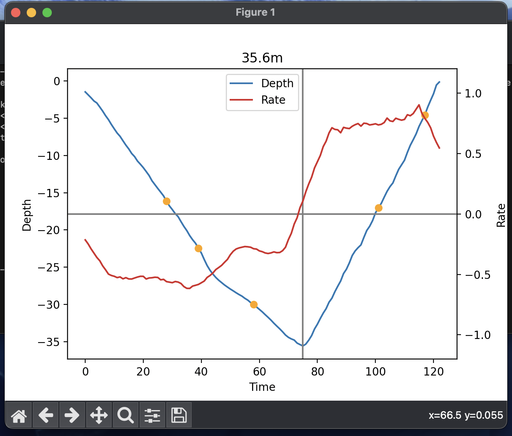

# Dive Graph

## Install

    pip install git+https://github.com/djaney/dive-graph.git

## Usage
```
Usage: dive-graph [OPTIONS] INPUT_PATH

  Show a graph of the dive data.

  INPUT_PATH is the path to the zip or fit file

Options:
  -i, --index INTEGER  Index of the dive to print. Interactive if not set
  --help               Show this message and exit.     
```

## Screenshots

